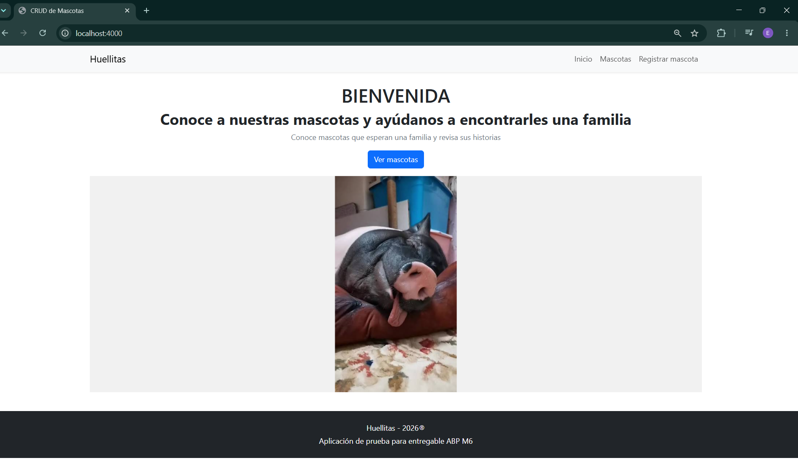
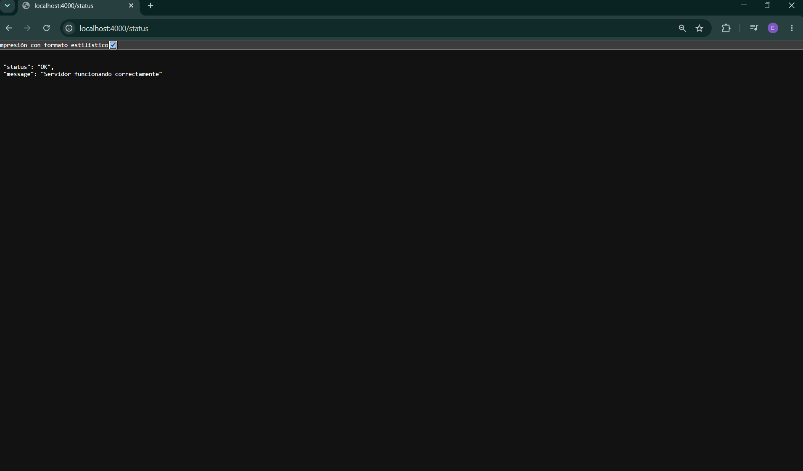
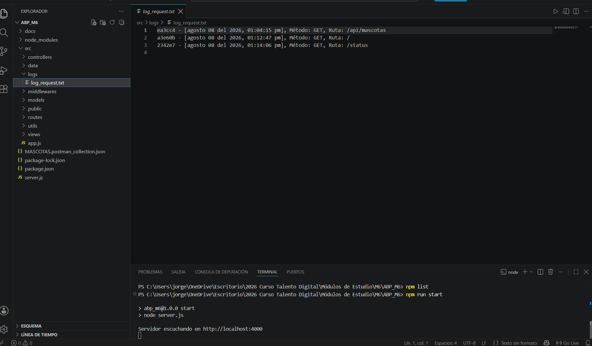

# Huellitas 🐾

Huellitas es una aplicación web desarrollada con Node.js y Express para gestionar el registro de mascotas.

El proyecto permite crear, consultar, actualizar y eliminar mascotas, utilizando un archivo JSON para almacenar la información.

Fue desarrollado como parte del Aprendizaje Basado en Proyectos (ABP) del Módulo 6 del curso Desarrollo de Aplicaciones Full Stack JavaScript Trainee.

## Funcionalidades principales

- Mostrar todas las mascotas registradas.
- Consultar una mascota mediante su ID.
- Registrar nuevas mascotas.
- Actualizar la información de una mascota.
- Eliminar una mascota.
- Almacenar los registros en un archivo JSON.
- Mostrar vistas dinámicas mediante Handlebars.
- Registrar las peticiones recibidas por el servidor.
- Consultar el estado del servidor mediante la ruta `/status`.
- Probar las rutas backend mediante Postman.

## Tecnologías utilizadas

- Node.js
- Express
- Express Handlebars
- JavaScript
- HTML
- CSS
- Bootstrap 5
- Moment.js
- UUID
- File System (`fs`)
- JSON
- Postman

## Instalación y ejecución

> La carpeta `node_modules` no se incluye en el repositorio ni en la entrega del proyecto, debido a su tamaño. Las dependencias necesarias están declaradas en `package.json` y pueden instalarse nuevamente mediante npm.

1. Clonar, descargar o descomprimir el proyecto.

2. Abrir una terminal en la carpeta raíz, donde se encuentra el archivo `package.json`.

3. Instalar todas las dependencias:

```bash
npm install
```

4. Iniciar el servidor:

```bash
npm start
```

5. Abrir la aplicación en el navegador:

```text
http://localhost:4000
```

Para comprobar el estado del servidor se puede visitar:

```text
http://localhost:4000/status
```

## Estructura del proyecto

```text
proyecto-mascotas/
├── docs/
│   └── img/
│       ├── inicio.png
│       ├── status.png
│       └── log-peticiones.png
├── src/
│   ├── controllers/
│   ├── data/
│   ├── logs/
│   ├── middlewares/
│   ├── models/
│   ├── public/
│   │   ├── css/
│   │   ├── img/
│   │   └── js/
│   ├── routes/
│   ├── utils/
│   ├── views/
│   │   ├── layouts/
│   │   └── partials/
│   └── app.js
├── MASCOTAS.postman_collection.json
├── package.json
├── package-lock.json
├── README.md
└── server.js
```

## Organización del proyecto

El proyecto fue organizado separando las distintas responsabilidades de la aplicación:

- `controllers`: contiene las funciones que reciben y responden las solicitudes.
- `data`: contiene el archivo JSON utilizado para almacenar las mascotas.
- `logs`: almacena el archivo con el registro de las peticiones.
- `middlewares`: está destinada a los middlewares de la aplicación.
- `models`: contiene la clase y los métodos relacionados con las mascotas.
- `routes`: define las rutas de las vistas y de la API.
- `utils`: contiene las funciones reutilizables de lectura, escritura y registro.
- `views`: contiene las plantillas creadas con Handlebars.
- `public`: contiene los recursos estáticos utilizados por el navegador.

## Carpeta `public`

La carpeta `public` fue creada para almacenar los archivos estáticos de la aplicación:

- Hojas de estilo CSS.
- Imágenes de las mascotas.
- Archivos JavaScript ejecutados desde el navegador.

Express permite entregar estos recursos mediante el middleware:

```js
app.use(express.static(path.join(__dirname, "public")));
```

De esta manera, el navegador puede solicitar directamente recursos como:

```text
/css/styles.css
/img/perrito1.jpg
/js/crearMascota.js
```

Esto permite mantener separados los archivos visibles de la aplicación y la lógica ejecutada en el servidor.

## Rutas de las vistas

| Método | Ruta | Descripción |
|---|---|---|
| GET | `/` | Muestra la página de inicio |
| GET | `/status` | Informa el estado del servidor en formato JSON |
| GET | `/mascotas` | Muestra las mascotas registradas |
| GET | `/mascota/perfil/:id` | Muestra el perfil de una mascota |
| GET | `/crear-mascota` | Muestra el formulario de registro |
| GET | `/mascotas/actualizar/:id` | Muestra el formulario de actualización |

## Rutas de la API

| Método | Ruta | Descripción |
|---|---|---|
| GET | `/api/mascotas` | Obtiene todas las mascotas |
| GET | `/api/mascotas/:id` | Obtiene una mascota mediante su ID |
| POST | `/api/mascotas` | Registra una nueva mascota |
| PUT | `/api/mascotas/:id` | Actualiza una mascota existente |
| DELETE | `/api/mascotas/:id` | Elimina una mascota mediante su ID |

Las rutas fueron probadas mediante Postman y a través de las acciones disponibles en la interfaz web.

También se comprobó que las operaciones realizadas modificaran correctamente el archivo JSON.

## Colección de Postman

La colección utilizada para probar las rutas backend fue exportada e incorporada en la raíz del proyecto:

```text
MASCOTAS.postman_collection.json
```

Esta colección permite importar nuevamente las solicitudes en Postman y comprobar las operaciones GET, POST, PUT y DELETE.

## Persistencia de datos

Los registros de las mascotas se almacenan en un archivo JSON ubicado en la carpeta `src/data`.

Para administrar la información se crearon funciones que permiten:

- Leer el archivo JSON.
- Convertir el contenido en datos utilizables por JavaScript.
- Agregar nuevas mascotas.
- Actualizar registros existentes.
- Eliminar registros.
- Escribir nuevamente la información actualizada.

Cada mascota recibe un identificador único generado mediante UUID.

## Registro de peticiones

La aplicación utiliza un middleware para registrar las peticiones recibidas por el servidor.

Cada registro contiene:

- Código único.
- Fecha y hora.
- Método HTTP.
- Ruta solicitada.

Los registros se agregan en el archivo:

```text
src/logs/log_request.txt
```

Para conservar los registros anteriores se utiliza `fs.appendFileSync()`.

Ejemplo:

```text
084ebf - [agosto 07 del 2026, 08:16:37 pm], Método: GET, Ruta: /status
```

El registro puede incluir las rutas principales y las solicitudes de archivos estáticos realizadas automáticamente por el navegador.

## Evidencias de funcionamiento

### Página de inicio

La ruta `/` entrega una página HTML renderizada mediante Handlebars.



### Estado del servidor

La ruta `/status` permite comprobar que el servidor está funcionando y entrega una respuesta en formato JSON.



### Registro de peticiones

El archivo de log conserva las peticiones recibidas por el servidor.



## Funcionalidades adicionales

Además de las funciones principales solicitadas para el proyecto, se incorporaron las siguientes mejoras:

- Interfaz web para administrar las mascotas.
- Motor de plantillas Handlebars.
- Layout principal reutilizable.
- Partial para la barra de navegación.
- Diseño responsivo con Bootstrap 5.
- Carrusel automático con imágenes de mascotas.
- Vista individual con el perfil de cada mascota.
- Formularios para registrar y actualizar mascotas.
- Acciones de la interfaz conectadas con la API.
- Archivos JavaScript separados para las acciones del navegador.
- Uso de Moment.js en español para las fechas de los logs.
- Generación de identificadores únicos mediante UUID.
- Colección de Postman exportada para comprobar las rutas backend.
- Carpeta de documentación con evidencias del funcionamiento.

## Proceso de aprendizaje

Durante el desarrollo fue necesario comprender cómo se relacionan las rutas, los controladores, el modelo, las vistas y el archivo utilizado para almacenar los datos.

Uno de los principales desafíos fue conseguir que las operaciones CRUD modificaran correctamente el archivo JSON. Para resolverlo fue necesario revisar las importaciones, los nombres de las propiedades y la función encargada de escribir nuevamente la información.

También se presentaron dificultades al actualizar una mascota, porque inicialmente los cambios se realizaban en memoria, pero no quedaban almacenados. Esto se solucionó incorporando la escritura del archivo después de modificar el registro.

Las pruebas realizadas con Postman y desde la interfaz permitieron detectar estos problemas, corregirlos y comprobar el funcionamiento completo de la aplicación.

## Decisiones tomadas

- Se eligió trabajar con mascotas para aplicar el CRUD a un caso práctico.
- Se utilizó un archivo JSON porque corresponde al tipo de persistencia estudiado en el módulo.
- Se separaron rutas, controladores, modelos, vistas y utilidades para mantener el proyecto organizado.
- Se creó la carpeta `public` para separar los recursos estáticos de la lógica del servidor.
- Se utilizó Handlebars para generar vistas dinámicas y reutilizar elementos.
- Se incorporó Bootstrap para mejorar la presentación visual de la aplicación.
- Se utilizó `fs.appendFileSync()` para conservar el historial de peticiones.
- Se probaron las rutas antes de conectarlas completamente con las vistas.

## Contenidos no implementados

Durante el módulo se mencionaron algunos elementos que no fueron implementados porque todavía no se habían estudiado en profundidad o no formaban parte del alcance desarrollado:

- Configuración del puerto mediante variables de entorno y `dotenv`.
- Validaciones mediante middlewares específicos.
- Manejo centralizado de errores.
- Conexión con una base de datos.
- Autenticación y autorización de usuarios.
- Publicación de la aplicación en un servicio de hosting.

Estos elementos se consideran posibles mejoras para los próximos módulos.

## Mejoras futuras

Como continuación del proyecto se podrían implementar las siguientes mejoras:

- Reemplazar la eliminación definitiva por un estado de adopción o inactividad.
- Agregar una fecha de adopción.
- Incorporar validaciones más completas.
- Mostrar mensajes personalizados de error.
- Guardar la información en una base de datos.
- Implementar usuarios y permisos.
- Permitir subir fotografías de las mascotas.
- Publicar la aplicación en internet.


## Control de versiones

El proyecto utiliza Git y GitHub para mantener un historial organizado de los cambios realizados.

La carpeta `node_modules` está excluida mediante el archivo `.gitignore`, porque contiene una gran cantidad de archivos y puede reconstruirse utilizando las dependencias declaradas en `package.json`.

Después de descargar o clonar el proyecto, las dependencias se recuperan ejecutando:

```bash
npm install

## Autor

**Jorge Ojeda**

Proyecto desarrollado con fines educativos para el curso Desarrollo de Aplicaciones Full Stack JavaScript Trainee.